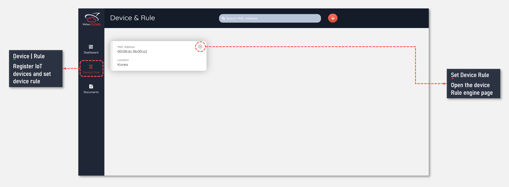
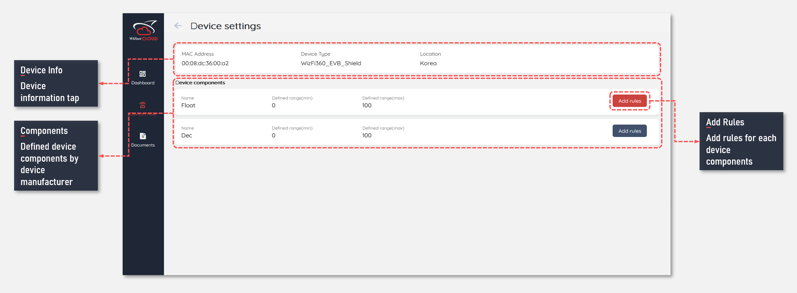

## Introduce of device rule engine
The data type that a IoT device certified to WIZnet is already defined by the manufacturer, and this has the advantage of being selectively utilized for specific applications. After registering the IoT device, the user is required to define user rules through ```Rule Engine```. At least one user rule should be defined for all data received from the registered IoT device.

## How to set device rule engine
When IoT device registration is complete, click ```Set Device Rule``` on IoT device in the list.



In IoT device setting menu, you can check the data types already defined by the manufacturer. Users define user rules for each data type.



The user can provide additional rules in addition to the three basic rules. If you assign a data rule, you can set ```Color``` and ```Data range``` indicated by the rule.

> `Users may add more than the three basic rules for a component with Multiple Rules function`


## how to edit device rule engine
To edit the created rule, click ```View Details```, a submenu of View rules as shown below, edit the existing rule through ```Edit``` button, and click the ```Save``` button.


## how to delete device rule engine
To delete the created rule, you can delete the existing rule through ```Remove``` button, which is a submenu of View rules, as shown below.


## device list
Devices certified to WIZnet Cloud are as follows.

- WizFi360-EVB-Mini
- WizFi360-EVB-Shield
- W510S2C

## Next

[IoT Device certified by WIZnet catalogue](/devices/wizfi360-evb-shield)

[Learn how to create user dashboard](/introduce_of_dashboard)

[Learn all types of widget supported from dashboard](/widgets)
