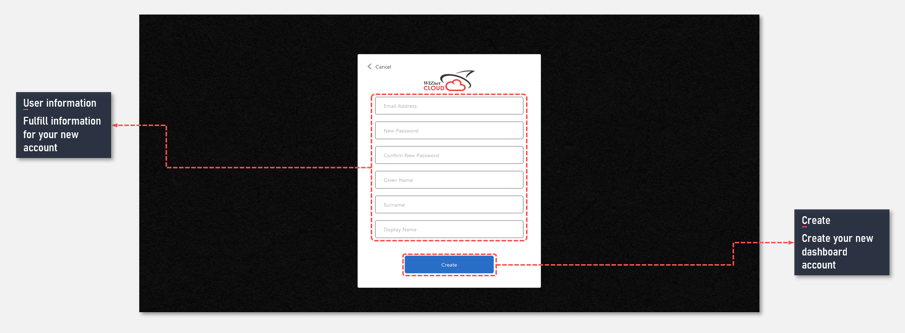

## What is a dashbaord account
For the dashboard service, users are required to create an dashboard account. Users can register IoT devices after logging in. When a device is registered, the user can monitor the data transmitted from the device through the dashboard.

> `Users may be limited in the services they can use depending on the type of account`

## How to create a new account
Create your new dashboard account as follows:

Open [Dashboard site](https://dashboard.wizcloud.io) and click the sign up to create new account.

## Next

[IoT Device certified by WIZnet catalogue](/devices/wizfi360-evb-shield)

[Introduce of dashboard](/introduce_of_dashboard)

[Learn how to create user dashboard](/introduce_of_dashboard)
