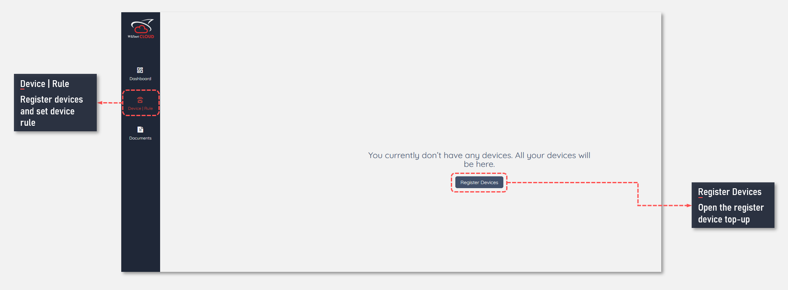
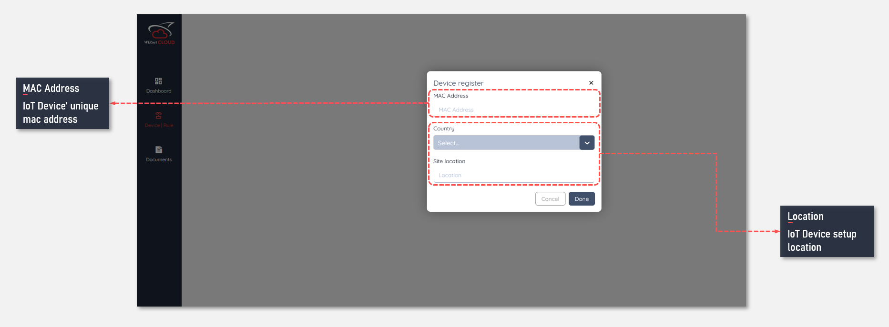
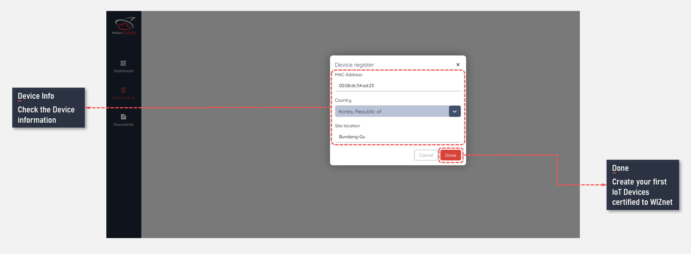
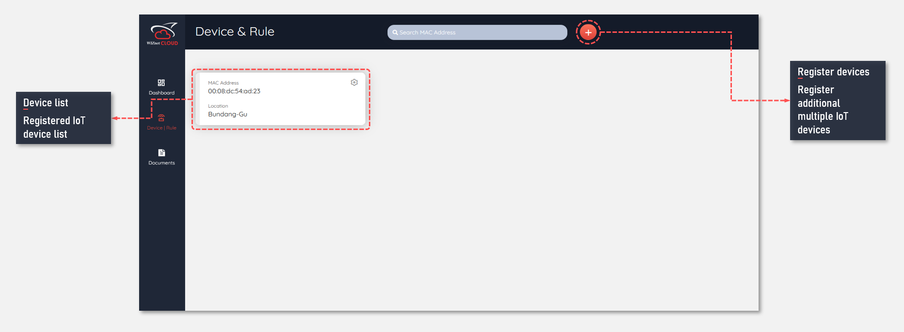
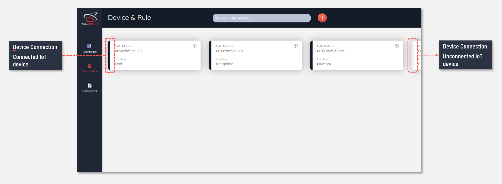
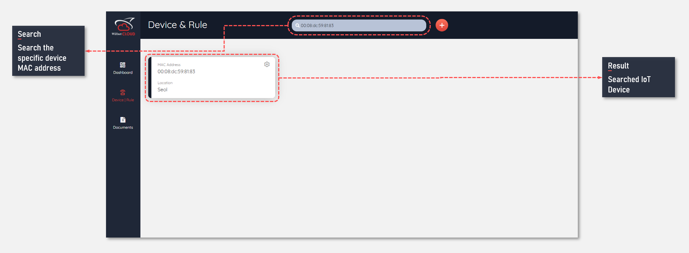

## Introduce of IoT devices registration
By registering the IoT device, the user can check the data transmitted to the device and deliver a specific message to the device. And in this process, only devices that Wiznet authenticates can be used as IoT devices. 


## How to register IoT devices
Users can check the page below through ```Device|Rule``` menu on the dashboard site, and register the IoT device through the ```Register Devices``` button at the top.



When registering your current device, you need to enter the following information: This is the device's unique MAC address and information about the country and region in which the device is used.
(The MAC address registered once cannot be registered repeatedly, and other MAC addresses other than the MAC address authenticated in Wiznet are not registered.)





When the device is registered, you can check it as follows.




## device connectoin
When the IoT device connects to the WIZnet Cloud after completing device registration, the color of the connection confirmation bar changes to check the connection as shown below.




## Search the registered IoT device
You can search through the MAC address of the registered device.




## device list
Devices certified to WIZnet Cloud are as follows:

- WizFi360-EVB-Mini
- WizFi360-EVB-Shield
- W510S2C


## Next

[IoT Device certified by WIZnet catalogue](/devices/wizfi360-evb-shield)

[Learn how to register IoT device](/how_to_register_IoT_devices)

[Learn device rule engine](/rule_engine)

